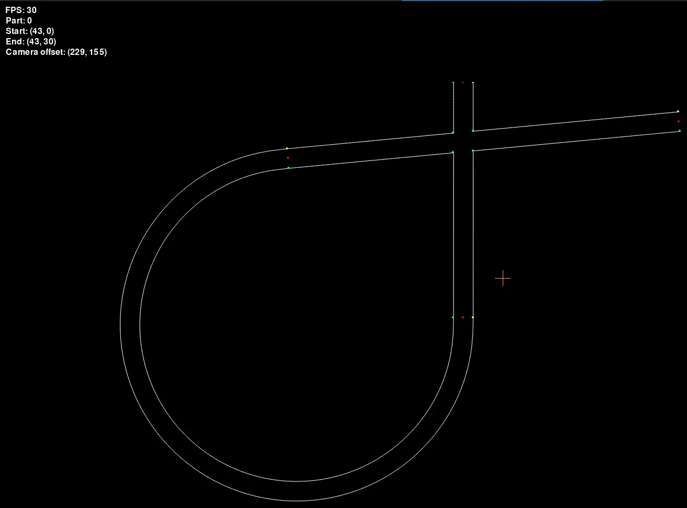

# trackgen



Simple track generator for the UMDRacing Driverless Simulation implementation.
Not complete, but proof of example works.

## Description of Track Format (UMDT)

This is a higher level format for describing a track layout. "Higher level" in
the sense that it does not describe individual cone positions.

### Overview

All distances are in metres. All angles are in degrees.

Configuration Variables:

- [distance_between_cones](#distance_between_cones)
- [width_of_track](#width_of_track)

List of individual supported track parts:

- [start](#start)
- [end](#end)
- [straight](#straight)
- [curve](#curve)
- [turn_left](#turn_left), [turn_right](#turn_right)
- [circle](#circle)
- [hairpin](#hairpin)
- [esses](#esses)
- [chicane](#chicane)
- [double_apex_turn](#double_apex_turn)

Special commands:

- [overlap](#overlap)

Each line is a simple csv-like-row. `<args>` is a list of comma separated
arguments. Spaces are considered.

Setting a configuration variable is done like so:

```csv
cfg,<name>,<args>
```

Describing a track section is done like so:

```csv
<track_section_name>,<args>
```

A `.umdt` file is as follows:

```csv
<list_of_configuration_cmds>
<list_of_track_section_cmds>
<list_of_special_cmds>
<list_of_track_section_cmds>
```

### Arguments of each Command

#### Configuration

##### distance_between_cones

The distance between every pair of cones along a track

Arguments:

- d: decimal

```csv
cfg,distance_between_cones,5
```

##### width_of_track

The distance between every pair of cones.

Arguments:

- d: decimal

```csv
cfg,width_of_track,1.5
```

##### allow_overlaps

Allow track sections to overlap.

Arguments:

- b: boolean

```csv
cfg,allow_overlaps,true
```

#### Track Sections

##### start

Represents the start cones of the track. Can only be present once in the track.

Arguments:
non

```csv
start
```

##### end

Represents the end cones of the track. Can only be present once in the track.

Arguments:
non

```csv
end
```

##### straight

A straight stretch along a track

Arguments:

- d: decimal, the length of the straight stretch.

```csv
straight,5
```

##### curve

This turn is achieved using BSpline magic (scipy). The curve factor is between
0 and 1, 0 being a straight line, and 1 being a max deviation of half of the
distance.

Arguments:

- direction: string, 'left' or 'right'
- f: decimal, curve factor
- d: number, distance of curve

```csv
curve,left,0.5,10
```

##### turn_left

A hard left 90 degree turn

Arguments:
non

```csv
turn_left
```

##### turn_right

A hard right 90 degree turn

Arguments:
non

```csv
turn_right
```

##### circle

A circle

Arguments:

- direction: string, 'left' or 'right'
- radius: decimal, radius of the circle
- degree: decimal, degree from the circle

```csv
circle,left,10,180
```

##### hairpin

What commonly known as a 180 turn. (is also secretly used internally
for half circles:D)

Arguments:

# TODO: radius, direction

non

```csv
hairpin
```

##### esses

Zigzags thing

Arguments:

- start_with_left: direction, whether to start by going left or right
- follow_prev_straight: boolean, whether turn the track so that the zigzag
  continues on the direction of the previous straight
- number_of_hcircles: int, number of half circles to create

```csv
esses,left,true,5
```

##### chicane

A 'Z' like turn with two curves of right and left.

Arguments:

- d: direction
- degree1: decimal, degree of first curve
- distance, decimal, how long the middle section is
- degree2: decimal, degree of second curve

```csv
chicane,left,45,10,45
```

##### double_apex_turn

A [chicane](#chicane), but same direction.

Arguments:

- d: direction
- distance, decimal, how long the middle section is

```csv
double_apex_turn,left,10
```

#### Special Commands

##### overlap

Allows the previous and the next track sections to overlap, useful for making
the 8-Track. Must be between two other normal track section.

```csv
<track_section_cmd>
overlap
<track_section_cmd>
```
